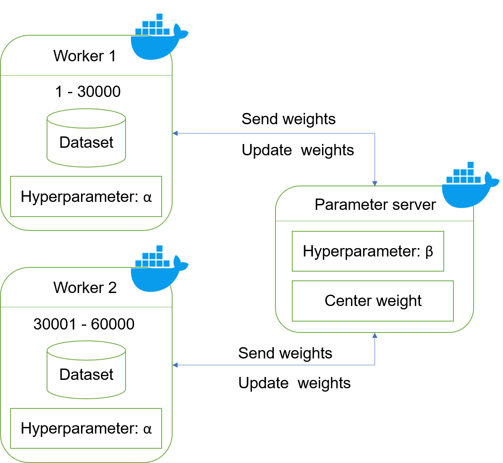
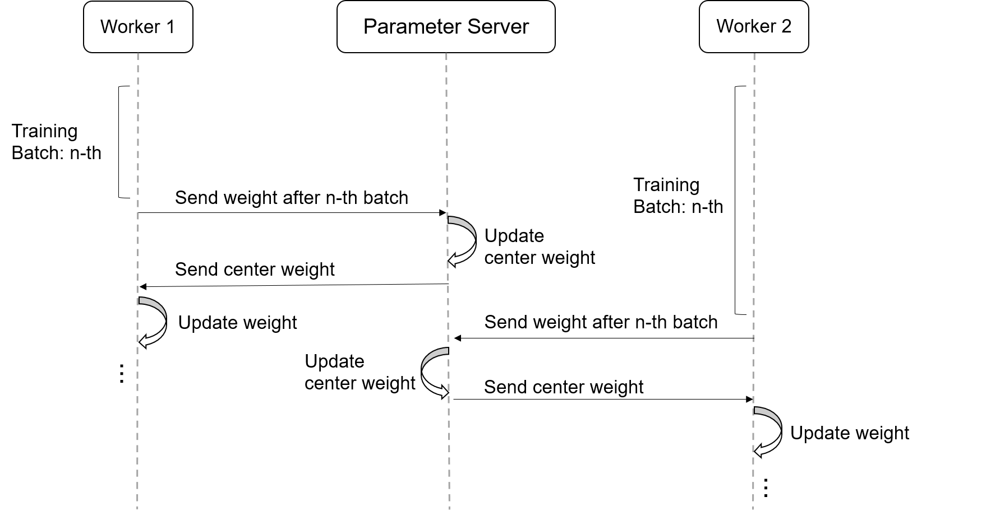

# Distributed Deep Neural Network - Asynchronous EASGD

## Branch: `async_easgd`

This branch implements an **Asynchronous Elastic Averaging Stochastic Gradient Descent (EASGD)** model using Data Parallelism. This approach enables multiple workers to train independently while maintaining coordination through elastic averaging to prevent divergence in distributed training.

---

## 🏗️ Architecture Overview

### Model Architecture
<p align="center">
  
</p>

### Workflow Diagram
<p align="center">
  
</p>

---

## 🔬 Algorithm Details

### Elastic Averaging Process

Each worker updates its local weights using standard SGD after every data batch. Simultaneously, after a predefined number of batches, the Elastic Averaging synchronization process is triggered asynchronously following these steps:

#### Step 1: Weight Transmission
Worker sends its current weights `w_worker` to the Parameter Server.

#### Step 2: Central Weight Update
Parameter Server updates the central weights `w̄` through two consecutive steps:
```
w̄ ← w̄ + β(w_worker1 - w̄)
w̄ ← w̄ + β(w_worker2 - w̄)
```

#### Step 3: Central Weight Distribution
Server sends the updated central weights `w̄` back to all workers.

#### Step 4: Local Weight Adjustment
Each worker adjusts its local weights toward the central weights:
```
w_worker ← w_worker + α(w̄ - w_worker)
```

### Hyperparameters
- **α (Alpha)**: Controls the elasticity level between local and central weights
- **β (Beta)**: Controls the central weight update rate from worker contributions

This mechanism allows workers to learn independently while being gently guided toward a common reference model, preventing divergence in asynchronous parallel training.

---

## 🚀 How to Run the Project

### Step 1: Clone the Repository
```bash
git clone https://github.com/phamchivy/Distributed_Deep_Neural_Network.git
cd Distributed_Deep_Neural_Network
```

### Step 2: Download the Dataset
```bash
python get_mnist_dataset.py
```

### Step 3: Build and Run the Containers
```bash
docker-compose up --build
```

### Step 4: Run Inference After Training
```bash
make -f Makefile.predict predict
./predict
```

### Step 5: Clean Up
```bash
make clean
make -f Makefile.predict clean
```

---

## 📝 Configuration & Notes

### Log Capture
```bash
docker-compose logs -f > log_file.txt
```

### Configuration Options
- **OpenMP thread count**: Edit `matrix/ops.c`
- **CPU core allocation**: Edit `docker-compose.yml`
- **EASGD parameters**: Configure α and β values for elasticity control
- **Synchronization frequency**: Adjust batch intervals for elastic averaging

### Recommendations
- Pre-build a separate image for the `monitor_container` defined in `docker-compose.yml`
- Tune α and β parameters based on your dataset and network architecture
- Monitor convergence behavior across workers to optimize synchronization frequency

---

## 🔍 Monitoring Tools

This project uses comprehensive monitoring tools:
- **Portainer** - Container orchestration and management
- **pidstat** - Process-level resource monitoring
- **docker stats** - Real-time container resource usage
- **htop** - Interactive system resource viewer

---

## 📁 Example Results

The `example_log/` directory contains sample output logs and convergence results from running the async EASGD system.

---

## 🛠️ Technical Details

### Asynchronous Training Benefits
- **Independent Learning**: Each worker trains on its local data without waiting for others
- **Elastic Coordination**: Gentle guidance prevents model divergence
- **Scalability**: System can handle varying worker speeds and network latencies
- **Fault Tolerance**: Workers can continue training even if some nodes fail temporarily

### Data Parallelism Implementation
- **Local SGD**: Each worker performs standard stochastic gradient descent
- **Periodic Synchronization**: Elastic averaging occurs at configurable intervals
- **Parameter Server**: Central coordination point for weight averaging
- **Asynchronous Communication**: Non-blocking updates between workers and server

### Key Advantages
1. **Reduced Communication Overhead**: Less frequent synchronization compared to synchronous methods
2. **Better Convergence**: Elastic averaging prevents catastrophic divergence
3. **Flexibility**: Workers can operate at different speeds
4. **Robustness**: System continues operating even with worker failures

### Mathematical Foundation
The EASGD algorithm balances between:
- **Exploration**: Workers can explore different regions of the loss landscape
- **Exploitation**: Central weights guide workers toward optimal solutions
- **Elasticity**: The α and β parameters control the trade-off between independence and coordination

---

## ⚙️ Parameter Tuning Guidelines

### Alpha (α) Parameter
- **Low values (0.1-0.3)**: More independence, slower convergence to consensus
- **High values (0.7-0.9)**: Faster consensus, potentially less exploration

### Beta (β) Parameter  
- **Low values (0.1-0.3)**: Conservative central weight updates
- **High values (0.5-0.8)**: Aggressive adaptation to worker updates

### Synchronization Frequency
- **High frequency**: Better coordination, higher communication cost
- **Low frequency**: More independence, risk of divergence

Optimal parameters depend on your specific dataset, network architecture, and infrastructure characteristics.