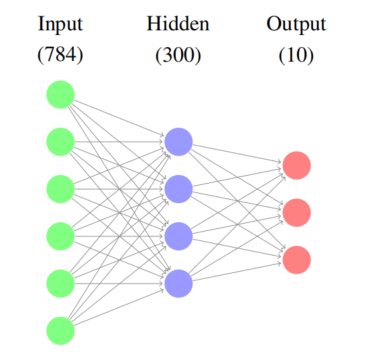

# Distributed Deep Neural Network - OpenMP Parallel

## Branch: `omp_parallel`

This branch implements a **single-container model** with configurable OpenMP thread count and CPU core allocation to evaluate parallel execution performance.

### Neural network architecture



Neural Network Architecture: 784-300-10, use sigmoid activation function. Loss: MSE.

---

## 🚀 How to Run the Project

### Step 1: Clone the Repository
```bash
git clone https://github.com/phamchivy/Distributed_Deep_Neural_Network.git

cd Distributed_Deep_Neural_Network
```

### Step 2: Download the Dataset
```bash
python get_mnist_dataset.py
```

### Step 3: Build and Run the Container
```bash
docker-compose up --build
```

### Step 4: Run Inference After Training
```bash
make predict

./predict
```

### Step 5: Clean Up
```bash
make clean
```

---

## 📝 Notes

### Log Capture
You can capture logs using:
```bash
docker-compose logs -f > log_file.txt
```

### Configuration Options
You may configure:
- **Number of OpenMP threads**: edit `matrix/ops.c`
- **Number of CPU cores**: edit `docker-compose.yml`

### Recommendations
It is recommended to pre-build a separate image for the `monitor_container` defined in `docker-compose.yml`

---

## 🔍 Monitoring Tools

This project uses the following tools to monitor container performance:
- **Portainer** - Container management interface
- **pidstat** - Process statistics monitoring
- **docker stats** - Real-time container resource usage
- **htop** - Interactive process viewer

---

## 📁 Example Logs

The `example_log/` directory contains sample output logs after running the system.

---

## 🛠️ Technical Details

### OpenMP Configuration
The parallel implementation leverages OpenMP for efficient multi-threading execution. Thread count can be adjusted based on your system's capabilities and performance requirements.

### Container Architecture
- Single-container deployment model
- Configurable CPU core allocation
- Built-in performance monitoring
- Scalable thread management

### Performance Evaluation
This branch is specifically designed to evaluate and benchmark parallel execution performance across different thread configurations and CPU allocations.