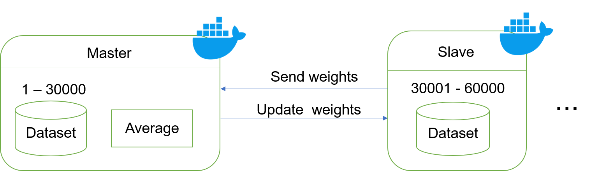
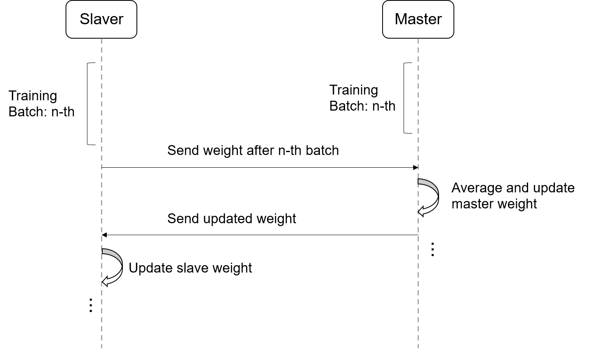

# Distributed Deep Neural Network - Master Slave

## Branch: `master_slave`

This branch implements a **Master-Slave architecture** using Data Parallelism for distributed deep neural network training. The system allows multiple worker nodes to train on different data partitions while coordinating through a master node.

---

## 🏗️ Architecture Overview

### Model Architecture


### Workflow Diagram


The master-slave model distributes training data across multiple slave nodes, with the master coordinating parameter updates and synchronization.

---

## 🔧 Key Implementation

### Core Function
```c
void network_train_batch_imgs_socket(
    NeuralNetwork* net,
    Img** imgs,
    int batch_size,
    int epochs,
    bool is_master,
    const char* ip,
    int port,
    int local_cpu_count, // <--- NEW PARAMETER
    Img** test_imgs
);
```

**Parameters:**
- `net`: Neural network instance
- `imgs`: Training image dataset
- `batch_size`: Number of images per batch
- `epochs`: Training iterations
- `is_master`: Flag to identify master/slave role
- `ip`: Network IP address for communication
- `port`: Communication port
- `local_cpu_count`: **NEW** - Local CPU count for optimization
- `test_imgs`: Test dataset for validation

---

## 🚀 How to Run the Project

### Step 1: Clone the Repository
```bash
git clone https://github.com/phamchivy/Distributed_Deep_Neural_Network.git
cd Distributed_Deep_Neural_Network
```

### Step 2: Download the Dataset
```bash
python get_mnist_dataset.py
```

### Step 3: Build and Run the Containers
```bash
docker-compose up --build
```

### Step 4: Run Inference After Training
```bash
make predict
./predict
```

### Step 5: Clean Up
```bash
make clean
```

---

## 📝 Configuration & Notes

### Log Capture
```bash
docker-compose logs -f > log_file.txt
```

### Configuration Options
- **OpenMP thread count**: Edit `matrix/ops.c`
- **CPU core allocation**: Edit `docker-compose.yml`
- **Network parameters**: Configure IP and port in the training function

### Recommendations
- Pre-build a separate image for the `monitor_container` defined in `docker-compose.yml`
- Ensure proper network connectivity between master and slave containers
- Monitor resource usage during distributed training

---

## 🔍 Monitoring Tools

This project uses comprehensive monitoring tools:
- **Portainer** - Container orchestration and management
- **pidstat** - Process-level resource monitoring
- **docker stats** - Real-time container resource usage
- **htop** - Interactive system resource viewer

---

## 📁 Example Results

The `example_log/` directory contains sample output logs and results from running the distributed system.

---

## 🛠️ Technical Details

### Data Parallelism
- **Training data distribution**: Each slave processes different data partitions
- **Parameter synchronization**: Master coordinates weight updates across slaves
- **Communication protocol**: Socket-based inter-node communication
- **Load balancing**: Dynamic workload distribution based on `local_cpu_count`

### Network Architecture
- **Master node**: Coordinates training, aggregates gradients, updates global model
- **Slave nodes**: Process local data batches, compute gradients, send updates to master
- **Synchronization**: Ensures model consistency across all nodes

### Performance Optimization
- Configurable CPU allocation per node
- OpenMP parallelization within each container
- Efficient network communication protocols
- Resource monitoring for bottleneck identification

---

## 🔄 Workflow Process

1. **Initialization**: Master sets up the neural network and distributes initial parameters
2. **Data Distribution**: Training dataset is partitioned across slave nodes
3. **Local Training**: Each slave trains on its data partition
4. **Gradient Aggregation**: Master collects and averages gradients from all slaves
5. **Parameter Update**: Master updates global model parameters
6. **Synchronization**: Updated parameters are distributed back to all slaves
7. **Iteration**: Process repeats for specified number of epochs

This distributed approach enables scalable training across multiple nodes while maintaining model accuracy through coordinated parameter updates.